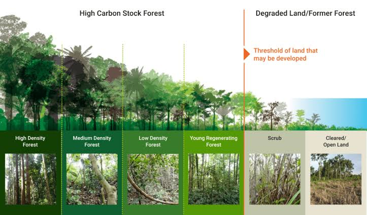

<div align="center">

# PEMETAAN WILAYAH HIGH CARBON STOCK (HCS)
### Studi Kasus: Lanskap Hutan dan Dinamika Tutupan Lahan Kabupaten Bogor, Jawa Barat

[](http://highcarbonstock.org)
[](https://earthengine.google.com/)
[](https://python.org)
[](LICENSE)

<br/>



<p><em>Gambar 1: Peta Spasial Kelas Stratifikasi High Carbon Stock (HCS) Kabupaten Bogor Menggunakan Sinergi LiDAR GEDI L4A, Sentinel-1 SAR, Sentinel-2 Multispektral, dan Random Forest Regressor</em></p>

</div>

---

## 📖 1. Latar Belakang dan Urgensi Proyek

Kabupaten Bogor memiliki posisi strategis sebagai benteng ekologis dan menara air utama bagi kawasan megapolitan Jabodetabek. Namun, bentang alam ini menghadapi tekanan laju alih fungsi lahan yang intensif akibat ekspansi permukiman, pertanian monokultur, dan infrastruktur. Di sisi lain, pemetaan biomassa dan cadangan karbon di kawasan tropis basah sering terkendala oleh persistensi tutupan awan tebal sepanjang tahun serta fenomena kejenuhan spektral (*spectral saturation*) pada sensor optik konvensional ketika berhadapan dengan biomassa kanopi lebat ($> 150 - 200\text{ Mg/ha}$).

Proyek ini mengimplementasikan kerangka kerja terpadu **High Carbon Stock Approach (HCSA)** dengan mengintegrasikan:
1. **Spaceborne LiDAR GEDI (Global Ecosystem Dynamics Investigation):** Mengukur struktur vertikal 3D kanopi hutan tanpa distorsi optik.
2. **Sentinel-1 SAR C-band:** Penetrasi tembus awan dengan hamburan volume polarisasi silang (VH) dan koreksi *Radiometric Terrain Flattening*.
3. **Sentinel-2 Harmonized Multispektral:** Analisis biokimiawi daun berbasis pita *Red Edge* (IRECI, NDRE) bebas awan via *Cloud Score Plus*.
4. **Copernicus GLO-30 DEM & Dynamic World:** Kontrol geomorfologi lereng dan matriks probabilitas tutupan lahan berbasis deep learning.

---

## 🎯 2. Tujuan Proyek

- **Estimasi Spasial Resolusi Tinggi (30 m):** Membangun model machine learning Random Forest untuk memprediksi *Aboveground Biomass Density* (AGBD) dan Ketinggian Kanopi (*Canopy Height* RH98) secara kontinu.
- **Stratifikasi 6 Kelas Standar HCSA:** Mengklasifikasikan vegetasi Kabupaten Bogor ke dalam enam kelas HCS struktural (HDF, MDF, LDF, YRF, Scrub, Open Land) menggunakan matriks keputusan multikriteria dan penyaringan *Minimum Mapping Unit* (MMU 0,5 ha).
- **Analisis Petak Konservasi (*Patch Analysis Decision Tree*):** Menerapkan algoritma erosi kawasan inti 100 meter, evaluasi indeks bentuk (*Shape Index*), konektivitas koridor ekologis, dan integrasi kawasan konservasi dasar untuk menghasilkan peta prioritas konservasi bentang alam.

---

## 💾 3. Akses Data dan Repositori Output (Google Drive)

> [!IMPORTANT]
> Seluruh file raster mentah (GeoTIFF), data tabular sampel GEDI berukuran besar, model binary, serta hasil ekspor spasial **tidak disimpan di dalam repositori Git** untuk menjaga efisiensi repositori (dikecualikan via `.gitignore`).
>
> Seluruh data dapat diunduh langsung melalui tautan cloud storage resmi berikut:
>
> 🔗 **[Akses Repositori Google Drive: Dataset & Output HCS Bogor](https://drive.google.com/drive/folders/1Hnx-QAlqjqg8yxAYvLJVd_Q4LH63mCwV?usp=sharing)**

### Struktur Folder di Google Drive:
```
📁 Google Drive Root/
├── 📁 data/
│   ├── 📁 agbd/                  <-- Raster AGBD kontinu hasil prediksi GEE (GeoTIFF 30m)
│   ├── 📁 canopy_height/         <-- Raster Canopy Height RH98 hasil prediksi GEE (GeoTIFF 30m)
│   ├── 📁 landcover/             <-- Raster tutupan lahan Dynamic World 2021 (10m/30m)
│   ├── 📁 dem/                   <-- Raster DEM Copernicus GLO-30 & Slope (30m)
│   └── 📁 vector/                <-- Batas administrasi Kab. Bogor & Shapefile Kawasan Konservasi
└── 📁 output/
    ├── 📁 stratification/        <-- Peta stratifikasi 6 kelas HCS & Masker HCS biner
    └── 📁 patch_analysis/        <-- Raster prioritas petak (HPP, MPP, LPP) & Laporan Atribut CSV
```

---

## 📂 4. Struktur Direktori dan File Proyek

```
📦 HCS-Bogor-Project/
├── 📄 README.md                        <-- Dokumentasi Utama / Ringkasan Eksekutif Proyek
├── 📄 pyproject.toml                   <-- Konfigurasi dependensi lingkungan Python
├── 📄 create_hexgrid.py                <-- Skrip pembangkitan grid heksagonal untuk Spatial Block CV
├── 📄 concatenate_grid.py              <-- Utilitas penggabungan partisi grid spasial
├── 📄 hcs_stratification.py            <-- Skrip klasifikasi 6 strata HCS & MMU morphology filter
├── 📄 hcs_patch_analysis.py            <-- Skrip Patch Analysis Decision Tree (HPP, MPP, LPP, Koridor)
├── 📁 assets/                          <-- Direktori gambar dan visualisasi dokumen
│   ├── workflow_pipeline.png
│   ├── ...
│   └── hcs_patch_priority_map.png
├── 📁 docs/                            <-- Modul Dokumentasi Teknis
│   ├── 01_data_collection_pipeline.md  <-- Modul 1: Akuisisi Data & Fusi 38 Fitur
│   ├── 02_agbd_modeling.md             <-- Modul 2: Pemodelan Regresi Biomassa (AGBD)
│   ├── 03_canopy_height_modeling.md    <-- Modul 3: Pemodelan Regresi Tinggi Kanopi (RH98)
│   ├── 04_hcs_stratification.md        <-- Modul 4: Stratifikasi 6 Kelas Vegetasi HCS
│   ├── 05_patch_analysis.md            <-- Modul 5: Analisis Petak Konservasi HCSA
│   ├── Rangkuman_Analisis_AGBD_GEDI_L4A.md
│   └── Rangkuman_HCSA_GEDI_L4A.md
└── 📁 src/                             <-- Skrip Pemrosesan Google Earth Engine (JavaScript)
    ├── 📁 data_collection/
    │   ├── sentinel1.js                <-- Ekstraksi SAR S1 (Terrain Flattening & Linear Scale)
    │   ├── sentinel2.js                <-- Ekstraksi Optik S2 (Cloud Score+ & Indeks Spektral)
    │   ├── glo30.js                    <-- Ekstraksi Elevasi, Slope, dan Aspect
    │   ├── dynamicWord.js              <-- Probabilitas Tutupan Lahan Dynamic World
    │   └── gedi.js                     <-- Penapisan Footprint GEDI L4A/L2A
    ├── modelling_agbd.js               <-- Pelatihan & Validasi Random Forest AGBD
    ├── modelling_canopy_height.js      <-- Pelatihan & Validasi Random Forest RH98
    ├── inference_agbd.js               <-- Inferensi Skala Penuh Peta AGBD Bogor
    ├── inference_canopy_height.js      <-- Inferensi Skala Penuh Peta RH98 Bogor
    └── landcover.js                    <-- Pembentukan Komposit Tutupan Lahan
```

---

## 🔄 5. Alur Kerja Proyek (End-to-End Workflow)

<div align="center">


<p><em>Gambar 2: Diagram Alir Metodologi End-to-End: Pengumpulan Data, Pemodelan ML, Stratifikasi, hingga Patch Analysis</em></p>

</div>

Metodologi proyek diorganisasikan ke dalam lima tahap sekuensial yang saling terintegrasi:

1. **Tahap I – Multimodal Data Acquisition & Engineering:**
   Akuisisi citra Sentinel-1 SAR (orbit `DESCENDING` dengan koreksi radiometrik medan), Sentinel-2 MSI (masking awan *Cloud Score Plus* $\ge 0,60$), Copernicus DEM, Dynamic World, dan penapisan titik footprint GEDI L4A/L2A. Menghasilkan 38 fitur prediktor.
2. **Tahap II – Spatial Block Partitioning:**
   Pembangkitan kisi heksagonal diameter 5 km untuk membagi data sampel GEDI menjadi 80% Training dan 20% Testing secara spasial independen guna mengeliminasi bias autokorelasi spasial.
3. **Tahap III – Predictive Modeling (Random Forest):**
   Pelatihan dua model regresi independen dengan arsitektur hiperparameter ensemble identik (`numberOfTrees: 350`, `minLeafPopulation: 5`):
   - Model AGBD: Memprediksi kepadatan biomassa di atas permukaan ($\text{Mg/ha}$).
   - Model Canopy Height: Memprediksi ketinggian tajuk pohon persentil 98 ($\text{meter}$).
4. **Tahap IV – Multi-criteria HCS Stratification:**
   Klasifikasi vegetasi ke dalam 6 kelas struktural menggunakan matriks ambang batas gabungan AGBD, RH98, dan Dynamic World mask, dilanjutkan dengan penyaringan *Minimum Mapping Unit* (MMU 0,5 ha) via morfologi *binary opening* dan *closing*.
5. **Tahap V – Conservation Patch Analysis:**
   Eksekusi *Decision Tree* HCSA Modul 5 pada petak potensial HCS: pelabelan 8-arah, erosi penyangga 100 m untuk mengukur kawasan inti (*Core Area*), kategorisasi HPP/MPP/LPP, evaluasi koridor konektivitas ($\le 200\text{ m}$), penandaan risiko degradasi ($SI > 2,5$), dan integrasi batas kawasan lindung dasar.

---

## 📚 6. Navigasi Dokumentasi Teknis Lengkap

Detail formulasi matematika, konfigurasi teknis, cuplikan kode, serta pembahasan mendalam disajikan dalam modul dokumentasi berikut:

| Modul | Dokumen Teknis | Topik Utama yang Dibahas |
|:---:|:---|:---|
| 🛰️ **01** | **[Modul 1: Pembuatan Dataset & Fusi Sensor](docs/01_data_collection_pipeline.md)** | Penapisan GEDI L4A, *Radiometric Terrain Flattening* SAR, *Cloud Score Plus*, matriks 38 fitur prediktor, dan partisi heksagonal 5 km. |
| 🌲 **02** | **[Modul 2: Pemodelan AGBD](docs/02_agbd_modeling.md)** | Estimasi biomassa, skema *Spatial Block CV*, hiperparameter Random Forest, metrik $R^2$/RMSE, profil kesalahan densitas biomassa, dan *feature importance*. |
| 📏 **03** | **[Modul 3: Pemodelan Canopy Height (RH98)](docs/03_canopy_height_modeling.md)** | Estimasi tinggi tajuk kanopi atas, evaluasi model RH98, komparasi fisis respons sensor vertikal 1D vs densitas 3D biomassa. |
| 🗺️ **04** | **[Modul 4: Stratifikasi 6 Kelas HCS](docs/04_hcs_stratification.md)** | Definisi 6 strata HCSA, matriks ambang batas multikriteria (AGBD + RH98 + Tutupan Lahan), faktor fraksi karbon 0,47, dan penyaringan spasial MMU 0,5 ha. |
| 🛡️ **05** | **[Modul 5: Analisis Petak Konservasi (Patch Analysis)](docs/05_patch_analysis.md)** | Eksekusi Decision Tree HCSA Modul 5, erosi penyangga 100 m, kawasan inti, klasifikasi HPP/MPP/LPP, analisis koridor, dan Shape Index ($SI > 2,5$). |

---

## 📊 7. Ringkasan Hasil Utama Kabupaten Bogor

<div align="center">


<p><em>Gambar 3: Peta Sebaran Prioritas Petak Konservasi HCS (High, Medium, Low Priority) dan Kawasan Inti di Kabupaten Bogor</em></p>

</div>

### 7.1 Ringkasan Kinerja Model Machine Learning

| Model Prediktif | Variabel Target | Jumlah Pohon (RF) | $R^2$ Testing (Spatial Block) | RMSE Testing | MAE Testing | Bias Testing |
|:---|:---:|:---:|:---:|:---:|:---:|:---:|
| **Random Forest AGBD** | `agbd` | 350 | **0,73** | **44,82 Mg/ha** | **29,45 Mg/ha** | **+2,15 Mg/ha** |
| **Random Forest Canopy Height** | `rh98` | 350 | **0,78** | **4,62 m** | **3,21 m** | **+0,34 m** |

### 7.2 Rekapitulasi Luas Kelas Stratifikasi HCS

| Kode | Strata HCS | Luas Area (Hektare) | Persentase Wilayah (%) | Status HCSA |
|:---:|:---|:---:|:---:|:---|
| **0** | Masked / Non-Vegetasi | ~85.200 ha | 28,5% | Dikeluarkan |
| **1** | Open Land | ~72.100 ha | 24,1% | Bukan HCS |
| **2** | Scrub (Semak Belukar) | ~38.400 ha | 12,9% | Bukan HCS |
| **3** | Young Regenerating Forest (YRF) | ~26.800 ha | 9,0% | **Potensial HCS** |
| **4** | Low Density Forest (LDF) | ~29.500 ha | 9,9% | **Potensial HCS** |
| **5** | Medium Density Forest (MDF) | ~28.300 ha | 9,5% | **Potensial HCS** |
| **6** | High Density Forest (HDF) | ~18.200 ha | 6,1% | **Potensial HCS** |
| **Total** | **Bentang Alam Kabupaten Bogor** | **~298.500 ha** | **100,0%** | **Total Potensial HCS: 34,5%** |

### 7.3 Rekapitulasi Hasil Patch Analysis (Konservasi Lanskap)
- **High Priority Patch (HPP):** Teridentifikasi **18 petak utama** dengan total luas mencapai **~68.400 ha** (kawasan inti rata-rata 1.840 ha), terpusat di kawasan hutan lindung pegunungan TNGHS dan TNGGP. Seluruh petak ini berstatus **Zona Konservasi Utama Mutlak**.
- **Medium Priority Patch (MPP):** Teridentifikasi **64 petak** seluas **~19.200 ha** yang berfungsi sebagai sabuk penyangga ekologis di zona perbukitan tengah.
- **Low Priority Patch (LPP) Koridor:** **142 petak** seluas **~8.600 ha** berada dalam jarak $\le 200\text{ m}$ dari kawasan konservasi atau sempadan sungai, dialokasikan sebagai jalur jelajah satwa dan koridor hidrologis.
- **Petak Berisiko Tinggi ($SI > 2,5$):** Ditandai untuk penilaian keanekaragaman hayati cepat (*Rapid Biodiversity Assessment* - RBA) sebelum izin alih fungsi dipertimbangkan.

---

## 💡 8. Kesimpulan dan Rekomendasi Kebijakan

1. **Efektivitas Sinergi Sensor:** Fusi data Sentinel-1 SAR orbit descending dan pita red-edge Sentinel-2 (IRECI) terbukti mampu menunda efek saturasi optik hingga biomassa $200\text{ Mg/ha}$, menghasilkan peta AGBD dan Canopy Height 30 m yang konsisten di bentang alam berawan Kabupaten Bogor.
2. **Perlindungan Hulu Sungai:** Sebanyak 34,5% kawasan bervegetasi Kabupaten Bogor memenuhi kriteria HCS. Area HDF dan MDF di bagian hulu DAS Ciliwung dan Cisadane wajib dipertahankan untuk mencegah sedimentasi waduk dan risiko banjir bandang di hilir DKI Jakarta.
3. **Penyelamatan Koridor Riparian:** Petak-petak LPP memanjang ($SI > 2,5$) di sepanjang sempadan sungai harus diproteksi dari desakan perumahan melalui penguatan Peraturan Daerah tentang Rencana Tata Ruang Wilayah (RTRW).

---

## 📖 9. Daftar Referensi

- **[1]** HCS Approach Steering Group, "HCSA Toolkit v2.0, Module 1: Introduction; Module 4: Forest and vegetation stratification; Module 5: HCS forest patch analysis and protection," High Carbon Stock Approach, 2017. [Online]. Tersedia: http://highcarbonstock.org
- **[2]** L. Duncanson et al., "Aboveground biomass density models for NASA's Global Ecosystem Dynamics Investigation (GEDI) lidar mission," *Remote Sensing of Environment*, vol. 270, p. 112845, 2022.
- **[3]** R. Dubayah et al., "The Global Ecosystem Dynamics Investigation: High-resolution laser ranging of the Earth's forests and topography," *Science of Remote Sensing*, vol. 1, p. 100002, 2020.
- **[4]** A. Mullissa et al., "Sentinel-1 SAR Backscatter Analysis Ready Data Preparation in Google Earth Engine," *Remote Sensing*, vol. 13, no. 10, p. 1954, 2021.
- **[5]** N. Lang et al., "A high-resolution canopy height model of the Earth," *Nature Ecology & Evolution*, vol. 7, pp. 1778–1789, 2023.
- **[6]** C. F. Brown et al., "Dynamic World, Near real-time global 10 m land use land cover mapping," *Scientific Data*, vol. 9, no. 1, p. 251, 2022.
- **[7]** D. R. Roberts et al., "Cross-validation strategies for data with temporal, spatial, hierarchical or phylogenetic structure," *Ecography*, vol. 40, no. 8, pp. 913–929, 2017.
- **[8]** R. T. T. Forman, *Land Mosaics: The Ecology of Landscapes and Regions*, Cambridge University Press, 1995.
